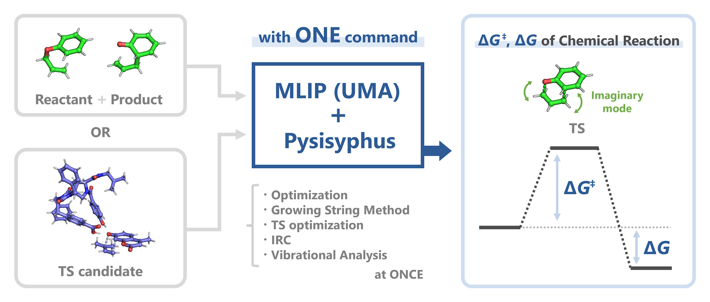

# UMA – Pysisyphus Interface

  

A wrapper that lets you call [Meta’s **UMA**](https://github.com/facebookresearch/fairchem) *Machine Learning Interatomic Potential* (MLIP) to use with the [**Pysisyphus** by J. Steinmetzer et al.](https://github.com/eljost/pysisyphus), a software suite for the exploration of potential energy surfaces.  

In this implementation, Energy, Forces and **Analytic Hessians** were extracted from the UMA model by back‑propagating *twice* through its neural network. This interface connects them to Pysisyphus so you can carry out growing‑string calculations, transition‑state searches, vibrational analysis, $\Delta G^{\ddagger}$ & $\Delta G$ calculations etc., with one of the latest MLIPs.

---

## 1 · Installation (including `fairchem-core` and `pysisyphus` installation)

### CUDA 12.6

```bash
pip install fairchem-core
pip install git+https://github.com/t-0hmura/uma_pysis.git
huggingface-cli login    # required to access the pretrained UMA checkpoints
```

### CUDA 12.8 (recommended for RTX 50 series)

```bash
pip install fairchem-core
pip install --force-reinstall torch==2.7.0 --index-url https://download.pytorch.org/whl/cu128
pip install git+https://github.com/t-0hmura/uma_pysis.git
huggingface-cli login
```
> UMA model is on Hugging Face Hub. You need to log in once.  
> See https://github.com/facebookresearch/fairchem

**Dependencies**

| package | version |
|---------|---------|
| Python  | ≥ 3.11  |
| PyTorch | 2.6 + (*or* 2.7.0 for CUDA 12.8) |
| fairchem‑core | — |
| Pysisyphus | — |
| ASE | >= 3.25.0 |
| NumPy | < 2.0 |

---

## 2 · Quick Start

### Command‑line

```bash
uma_pysis input.yaml
```
When you install this library, a command named `uma_pysis` and a Pysisyphus calculator are automatically registered in your environment. By passing a Pysisyphus YAML input file like the one above, you can run all of Pysisyphus’s features with UMA. In the YAML file, configure the calculator as shown below. For an example, see `examples/small/input.yaml`.
```yaml
calc:
 type: uma_pysis   # Calculator type for Pysisyphus. No need to change.
 charge: 0         # Charge of input system.
 spin: 1           # Multiplicity of input system.
 model: uma-s-1p1  # Name of UMA model checkpoint. Currently, uma-s-1p1 and uma-m-1p1 (and uma-s-1) are available.
 task_name: omol   # Task name. Currently, oc20, omat, omol, odac and omc are available.
 device: auto      # "auto", "cpu", or "cuda".
```

### Python API

```python
# examples/small/example.py
from uma_pysis import uma_pysis
from pysisyphus.io.xyz import geom_from_xyz

geom = geom_from_xyz('reac.xyz')
calc = uma_pysis(charge=0, spin=1, model="uma-s-1p1", task_name="omol", device="auto")

geom.set_calculator(calc)

E = geom.energy     # Hartree
F = geom.forces     # Hartree·Bohr⁻¹
H = geom.hessian    # (3N × 3N) analytic Hessian

print(f'Energy: {E:.6f} Hartree')
print(f'Max Force : {F.max():.6f} Hartree·Bohr⁻¹')
print(f"Hessian shape: {H.shape}")
```

---

## 3 · Examples

The **examples** directory has the following content:

```
examples/
├── small/              # Example of small system
│   ├── reac.xyz        # Reactant geometry
│   ├── prod.xyz        # Product geometry
│   ├── input.yaml      # Input for Pysisyphus (Reactant & Product --> $\Delta G^{\ddagger}$ & $\Delta G$)
│   └── example.py      # Example for Python API
├── large/              # Example of large system
│   ├── ts_cand.xyz     # TS candidate geometry
│   └── input.yaml      # Input for Pysisyphus (TS candidate --> $\Delta G^{\ddagger}$ & $\Delta G$)
└── run.sh              # Bash script to run every example
```

Running  
```bash
cd examples/small
uma_pysis input.yaml
```
calculate $\Delta G^{\ddagger}$ and $\Delta G$ of the Aromatic Claisen rearrangement from allyl phenyl ether to 6-(prop-2-en-1-yl) cyclohexa-2,4-dien-1-one **in ONE command** from structures of **Reactant** & **Product**.  
> It should be $\Delta G^{\ddagger}$ = 176.53 kJ mol⁻¹ ≒ 42.18 kcal mol⁻¹ and $\Delta G$ = 57.08 kJ mol⁻¹ ≒ 13.64 kcal mol⁻¹.

Also, running  
```bash
cd examples/large
uma_pysis input.yaml
```
calculate $\Delta G^{\ddagger}$ and $\Delta G$ of the Aromatic Claisen rearrangement catalyzed by *Spiroligozyme* BPC13 (an enzyme-mimicking compound) **in ONE command** from a structure of **TS candidate** (Parker, M. et al. (2014). J. Am. Chem. Soc. 136(10), 3817–3827. doi: 10.1021/ja409214c).  
> It should be $\Delta G^{\ddagger}$ = 83.4 kJ mol⁻¹ ≒ 19.9 kcal mol⁻¹ and $\Delta G$ = -6.76 kJ mol⁻¹ ≒ -1.62 kcal mol⁻¹. (Reactant is shown as 'Right' in the log.)

> See **https://pysisyphus.readthedocs.io** for more information about **Pysisyphus**.

## References
[1] Wood, B. M., Dzamba, M., Fu, X., Gao, M., Shuaibi, M., Barroso-Luque, L., Abdelmaqsoud, K., Gharakhanyan, V., Kitchin, J. R., Levine, D. S., Michel, K., Sriram, A., Cohen, T., Das, A., Rizvi, A., Sahoo, S. J., Ulissi, Z. W., & Zitnick, C. L. (2025). UMA: A Family of Universal Models for Atoms. http://arxiv.org/abs/2506.23971   
[2] Steinmetzer, J., Kupfer, S., & Gräfe, S. (2021). pysisyphus: Exploring potential energy surfaces in ground and excited states. International Journal of Quantum Chemistry, 121(3). https://doi.org/10.1002/qua.26390

## License
`uma_pysis` is distributed under the **GNU General Public License version 3 (GPL-3.0)** derived from Pysisyphus.  

## Citation
This work is by-product of [**ML/MM toolkit**](https://github.com/t-0hmura/mlmm_toolkit). If you find this work helpful for your research, please cite:  
[3] Ohmura, T., Inoue, S., Terada, T. (2025). ML/MM toolkit – Towards Accelerated Mechanistic Investigation of Enzymatic Reactions. ChemRxiv. doi:10.26434/chemrxiv-2025-jft1k
